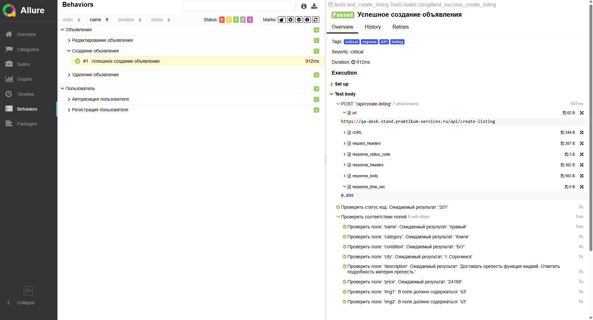

# Sprint 10 — API Test Framework

Автоматизированное тестирование REST API сервиса объявлений [QA Desk](https://qa-desk.stand.praktikum-services.ru).

Стек: `pytest` · `requests` · `pydantic v2` · `allure` · `faker` · `pytest-xdist`

---

## Покрытие

| Модуль | Тест-кейс | Severity |
|--------|-----------|----------|
| Регистрация | Успешная регистрация | blocker |
| Регистрация | Повторная регистрация → ошибка | normal |
| Авторизация | Успешная авторизация | blocker |
| Объявления | Успешное создание | critical |
| Объявления | Успешное редактирование | critical |
| Объявления | Редактирование чужого объявления → 401 | normal |
| Объявления | Успешное удаление | normal |

---

## Структура проекта

```
Sprint_10_API/
├── clients/          # HTTP-клиенты (base, user, listing)
├── models/
│   ├── requests/     # Pydantic-модели запросов
│   └── responses/    # Pydantic-модели ответов
├── helpers/          # allure_logger, build_curl, multipart
├── asserts/          # Кастомные assert-хелперы
├── utils/            # Декораторы маркеров (severity, tag)
├── data/listing/     # Тестовые изображения
├── tests/            # Тест-кейсы
├── config.py         # Настройки (BASE_URL, timeout)
└── conftest.py       # Фикстуры pytest
```

---

## Установка

### 1. Клонировать репозиторий

```bash
git clone <url>
cd <project-folder>
```

### 2. Создать виртуальное окружение

```bash
py -3.12 -m venv .venv
```

### 3. Активировать

**Git Bash / Mac / Linux:**

```bash
source .venv/Scripts/activate
```

**Windows CMD:**

```cmd
.venv\Scripts\activate.bat
```

**Windows PowerShell:**

```powershell
.venv\Scripts\Activate.ps1
```

После активации в начале строки появится `(.venv)`.

### 4. Установить зависимости

```bash
pip install .
```

---

## Запуск тестов

Запустить все тесты с генерацией Allure-отчёта:

```bash
pytest
```

Запустить по маркеру:

```bash
pytest -m smoke
pytest -m "regress and listing"
```

Запустить в один поток (без xdist):

```bash
pytest -n0
```

---

## Allure-отчёт

Сгенерировать и открыть отчёт:

```bash
allure serve allure_result
```



---

## Линтер

```bash
ruff check .        # проверить
ruff check . --fix  # автоисправить
```